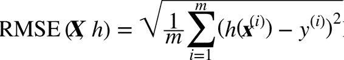

# 二、端到端的机器学习项目

## 项目概览

### 划定问题

### 选择性能指标

#### 均方根误差

回归问题的典型指标是均方根误差（RMSE）。均方根误差测量的是系统预测误差的标准差。

例如，RMSE 等于 50000，意味着，68% 的系统预测值位于实际值的 50000 美元以内，95% 的预测值位于实际值的 100000 美元以内。

一个特征通常都符合高斯分布，即满足 “68-95-99.7”规则：大约 68% 的值落在`1σ`内，95% 的值落在`2σ`内，99.7% 的值落在`3σ`内，这里的`σ`等于 50000。



公式 2-1 均方根误差（RMSE）

> 符号的含义
>
> 这个方程引入了一些常见的贯穿本书的机器学习符号：
>
> * `m`是测量 RMSE 的数据集中的实例数量。  
>     例如，如果用一个含有 2000 个街区的验证集求 RMSE，则`m = 2000`。
>
> * `x^(i)`是数据集第`i`个实例的所有特征值（不包含标签）的向量，`y^(i)`是它的标签（这个实例的输出值）。 
>
>     例如，如果数据集中的第一个街区位于经度 –118.29°，纬度 33.91°，有 1416 名居民，收入中位数是 38372 美元，房价中位数是 156400 美元（忽略掉其它的特征），则有：  
>
>     
>
>     和，  
>
>     
>
> * `X`是包含数据集中所有实例的所有特征值（不包含标签）的矩阵。每一行是一个实例，第`i`行是`x^(i)`的转置，记为`x^(i)^T`。
>
>   例如，仍然是前面提到的第一区，矩阵`X`就是：  
>
>     
>
> * `h`是系统的预测函数，也称为假设（hypothesis）。当系统收到一个实例的特征向量`x^(i)`，就会输出这个实例的一个预测值`y_hat = h(x^(i))`（`y_hat`读作`y-hat`）。  
>
>     例如，如果系统预测第一区的房价中位数是 158400 美元，则`y_hat^(1) = h(x^(1)) = 158400`。预测误差是 `y_hat^(1) - y^(1) = 2000`。
>
> *   `RMSE(X,h)`是使用假设`h`在样本集上测量的损失函数。
>
> 我们使用小写斜体表示标量值（例如`m`或`y^(i)`）和函数名（例如`h`），小写粗体表示向量（例如`x^(i)`），大写粗体表示矩阵（例如`X`）。

#### 平均绝对误差

虽然大多数时候 RMSE 是回归任务可靠的性能指标，在有些情况下，你可能需要另外的函数。例如，假设存在许多异常的街区。此时，你可能需要使用平均绝对误差（Mean Absolute Error，也称作平均绝对偏差），见公式 2-2：


公式 2-2 平均绝对误差

#### 范数

向量的范数可以简单形象的理解为向量的长度，或者向量到零点的距离，或者相应的两个点之间的距离。

常用的向量的范数：

*   L0 范数（汉明范数）：为 x 向量各个非零元素的个数；
*   L1 范数（曼哈顿范数）：为 x 向量中非零元素的绝对值之和；
*   L2 范数（欧几里得（Euclidean）范数）：为 x 向量各个元素平方和的 1/2 次方。L2 范数是最常见的两点之间或多点之间的距离表示法，又称 Frobenius 范数；
*   Lk 范数（K 阶闵氏范数）：为 x 向量各个元素绝对值 k 次方和的 1/k 次方；
*   L∞范数（切比雪夫范数）：为 x 向量各个元素绝对值最大那个元素的绝对值，如下：`|x|∞=max(|x1|,|x2|,…,|xn|)`；
*   范数的指数越高，就越关注大的值而忽略小的值。这就是为什么 RMSE 比 MAE 对异常值更敏感。但是当异常值是指数分布的（类似正态曲线），RMSE 就会表现很好。

### 核实假设

## 获取数据

### 创建工作空间

### 下载数据

### 快速查看数据结构


图 2-8 每个数值属性的柱状图

### 创建测试集

#### 纯随机的取样方法

理论上，创建测试集很简单：只要随机挑选一些实例，一般是数据集的 20%。

这个方法可行，但是并不完美：如果再次运行程序，就会产生一个不同的测试集！多次运行之后，你（或你的机器学习算法）就会得到整个数据集，这是需要避免的。

解决的办法之一是保存第一次运行得到的测试集，并在随后的过程加载。另一种方法是在调用`np.random.permutation()`之前，设置随机数生成器的种子（比如`np.random.seed(42)`），以产生总是相同的洗牌指数（shuffled indices）。

但是如果数据集更新，这两个方法都会失效。一个通常的解决办法是使用每个实例的 ID 来判定这个实例是否应该放入测试集（假设每个实例都有唯一并且不变的 ID）。

#### 分层采样

例如，美国人口的 51.3% 是女性，48.7% 是男性。所以在美国，严谨的调查需要保证样本也是这个比例：513 名女性，487 名男性。这称作分层采样（stratified sampling）：将人群分成均匀的子分组，称为分层，从每个分层去取合适数量的实例，以保证测试集对总人数有代表性。

### 查找关联

可以使用`corr()`方法计算出每对属性间的标准相关系数（standard correlation coefficient，也称作皮尔逊相关系数）

相关系数的范围是 -1 到 1。当接近 1 时，意味强正相关；当相关系数接近 -1 时，意味强负相关；最后，相关系数接近 0，意味没有线性相关性。

> 警告：相关系数只测量线性关系。相关系数可能会完全忽略非线性关系（例如，如果`x`接近 0，则`y`值会变高）。

画出每个数值属性对每个其它数值属性的图。


图 2-15 散点矩阵


图 2-16 收入中位数 vs 房价中位数

这张图说明了几点。首先，相关性非常高；可以清晰地看到向上的趋势，并且数据点不是非常分散。第二，我们之前看到的最高价，清晰地呈现为一条位于 500000 美元的水平线。这张图也呈现了一些不是那么明显的直线：一条位于 450000 美元的直线，一条位于 350000 美元的直线，一条在 280000 美元的线，和一些更靠下的线。你可能希望去除对应的街区，以防止算法重复这些巧合。

### 属性组合试验

例如，如果你不知道某个街区有多少户，该街区的总房间数就没什么用。你真正需要的是每户有几个房间。

## 为机器学习算法准备数据

### 数据清洗

此先创建一些函数来处理特征缺失的问题。前面，你应该注意到了属性`total_bedrooms`有一些缺失值。有三个解决选项：

+   去掉对应的街区；
+   去掉整个属性；
+   进行赋值（0、平均值、中位数等等）。

> 均值（Mean）：
> 均值是一组数据的所有值相加后除以数据的总数量。它是数据的平衡点，受到数据中每个值的影响。均值对异常值（极端值）非常敏感，一个异常值可以显著地影响均值，使其偏离正常数据的中心。
> 
> 中位数（Median）：
> 中位数是将一组数据的值按照大小排列后，位于中间位置的值。如果数据的数量是奇数，则中位数就是排序后的中间值；如果数据数量是偶数，则中位数是排序后中间两个值的平均值。中位数对异常值的影响较小，因为它不受异常值的影响，只取决于排序后的数据位置。
> 
> 选择使用均值还是中位数取决于数据的性质和分布。如果数据中存在异常值，使用中位数可能更合适，因为中位数不受异常值的影响，更能反映数据的中心位置。如果数据分布接近正态分布，均值可能更能代表数据的平均情况。

### 处理文本和类别属性

把文本标签转换为数字，得到如：

```py
>>> housing_cat_encoded
array([1, 1, 4, ..., 1, 0, 3])
```

这种做法的问题是，ML 算法会认为两个临近的值比两个疏远的值要更相似。显然这样不对（比如，分类 0 和分类 4 就比分类 0 和分类 1 更相似）。要解决这个问题，一个常见的方法是给每个分类创建一个二元属性：当分类是<1H OCEAN，该属性为 1（否则为 0），当分类是INLAND，另一个属性等于 1（否则为 0），以此类推。这称作独热编码（One-Hot Encoding），因为只有一个属性会等于 1（热），其余会是 0（冷）。

```py
>>> housing_cat_1hot
array([[ 0.,  1.,  0.,  0.,  0.],
       [ 0.,  1.,  0.,  0.,  0.],
       [ 0.,  0.,  0.,  0.,  1.],
       ...,
       [ 0.,  1.,  0.,  0.,  0.],
       [ 1.,  0.,  0.,  0.,  0.],
       [ 0.,  0.,  0.,  1.,  0.]])
```

即从文本分类到整数分类，再从整数分类到独热向量。

### 自定义转换器

### 特征缩放

数据要做的最重要的转换之一是特征缩放。除了个别情况，当输入的数值属性量度不同时，机器学习算法的性能都不会好。

有两种常见的方法可以让所有的属性有相同的量度：线性函数归一化（Min-Max scaling）和标准化（standardization）。

线性函数归一化（许多人称其为归一化（normalization））很简单：值被转变、重新缩放，直到范围变成 0 到 1。我们通过减去最小值，然后再除以最大值与最小值的差值，来进行归一化。

标准化就很不同：首先减去平均值（所以标准化值的平均值总是 0），然后除以方差，使得到的分布具有单位方差。与归一化不同，标准化不会限定值到某个特定的范围，这对某些算法可能构成问题（比如，神经网络常需要输入值得范围是 0 到 1）。但是，标准化受到异常值的影响很小。

### 转换流水线

## 选择并训练模型

### 在训练集上训练和评估

### 使用交叉验证做更佳的评估

K 折交叉验证（K-fold cross-validation）：它随机地将训练集分成十个不同的子集，成为“折”，然后训练评估决策树模型 10 次，每次选一个不用的折来做评估，用其它 9 个来做训练。结果是一个包含 10 个评分的数组。

## 模型微调

### 网格搜索

### 随机搜索

### 集成方法

### 分析最佳模型和它们的误差

### 用测试集评估系统