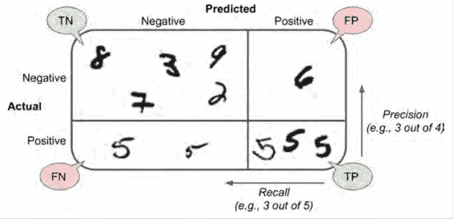
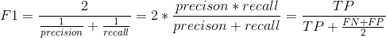
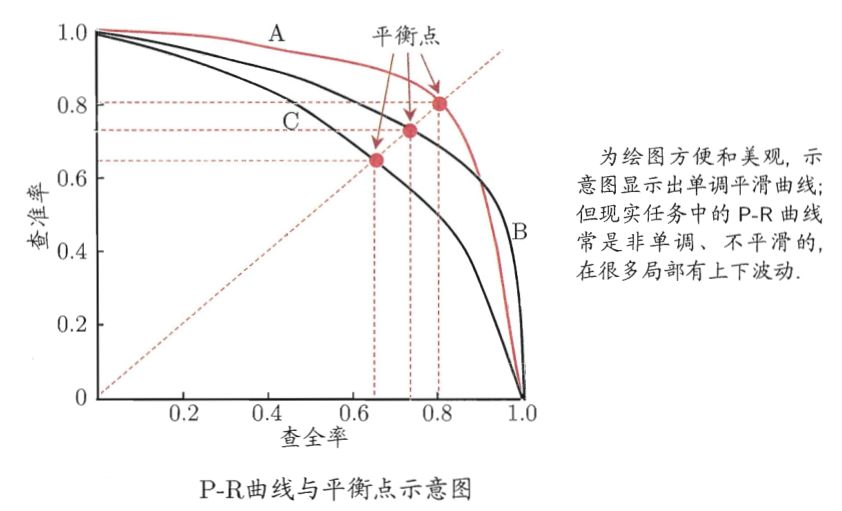
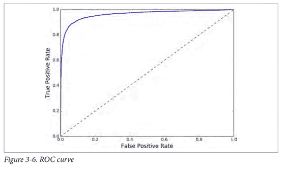
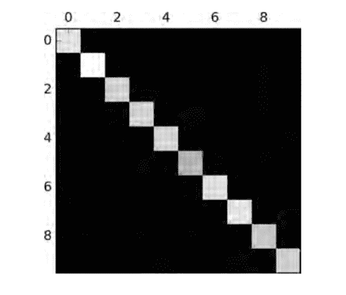
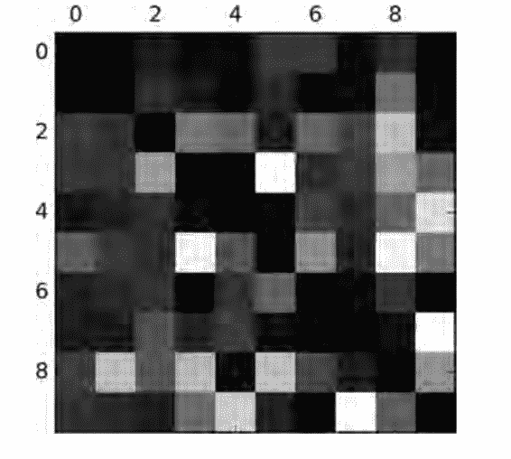

# 三、分类

## 训练一个二分类器

## 对性能的评估

### 交叉验证测量准确性

### 混淆矩阵

混淆矩阵中的每一行表示一个实际的类, 而每一列表示一个预测的类。该矩阵的第一行认为“非 5”（反例）中的 53272 张被正确归类为 “非 5”（他们被称为真反例，true negatives）, 而其余 1307 被错误归类为"是 5" （假正例，false positives）。第二行认为“是 5” （正例）中的 1077 被错误地归类为“非 5”（假反例，false negatives），其余 4344 正确分类为 “是 5”类（真正例，true positives）。一个完美的分类器将只有真反例和真正例，所以混淆矩阵的非零值仅在其主对角线（左上至右下）。

*   True Positive（真正，TP）：将正类预测为正类数；
*   True Negative（真负，TN）：将负类预测为负类数；
*   False Positive（假正，FP）：将负类预测为正类数 → 误报；
*   False Negative（假负,FN）：将正类预测为负类数 → 漏报。

#### 准确率（Accuracy）

准确率的定义，即预测正确的结果占总样本的百分比，表达式为：

$$Accuracy=\frac{TP+TN}{TP+TN+FP+FN}$$

虽然准确率能够判断总的正确率，但是在样本不均衡的情况下，并不能作为很好的指标来衡量结果。

因为只有 10% 的图片是数字 5，所以你总是猜测某张图片不是 5，你也会有 90% 的可能性是对的。

#### 精确率（Precision）

精确率是针对预测结果而言的，其含义是在被所有预测为正的样本中实际为正样本的概率，表达式为：

$$Precision=\frac{TP}{TP+FP}$$

想要一个完美的准确率，一个平凡的方法是构造一个单一正例的预测和确保这个预测是正确的（precision = 1/1 = 100%）。但是这什么用，因为分类器会忽略所有样例，除了那一个正例。

#### 召回率（Recall）

召回率是针对原样本而言的，其含义是在实际为正的样本中被预测为正样本的概率，表达式为：

$$Recall=\frac{TP}{TP+FN}$$

召回率也叫做敏感度（sensitivity）或者真正率（true positive rate， TPR）。

#### F1值、F1分数（F1-Score）

通常结合精确率和召回率会更加方便，这个指标叫做“F1 值”。

F1 值是精确率和召回率的调和平均。普通的平均值平等地看待所有的值，而调和平均会给小的值更大的权重。所以，要想分类器得到一个高的 F1 值，需要召回率和精确率同时高。

### 精确率/召回率之间的折衷

精确率和召回率又被叫做查准率和查全率，可以通过P-R图进行表示。

增加精确率会降低召回率，反之亦然。这叫做精确率与召回率之间的折衷。

### ROC 曲线

受试者工作特征（ROC）曲线是另一个二分类器常用的工具。ROC 曲线是真正率（true positive rate，TPR 召回率）对假正率（false positive rate, FPR）的曲线。FPR 是反例被错误分成正例的比率。它等于 1 减去真反例率（true negative rate，TNR）。TNR 是反例被正确分类的比率。TNR 也叫做特异性。所以 ROC 曲线画出召回率对（1 减特异性）的曲线。

$$TPR=\frac{TP}{TP+FN}$$

$$FPR=\frac{FP}{FP+TN}$$

这里同样存在折衷的问题：召回率（TPR）越高，分类器就会产生越多的假正例（FPR）。图中的点线是一个完全随机的分类器生成的 ROC 曲线；一个好的分类器的 ROC 曲线应该尽可能远离这条线（即向左上角方向靠拢）。

一个比较分类器之间优劣的方法是：测量 ROC 曲线下的面积（AUC）。一个完美的分类器的 ROC AUC 等于 1，而一个纯随机分类器的 ROC AUC 等于 0.5。

## 多类分类

二分类器只能区分两个类，而多类分类器（也被叫做多项式分类器）可以区分多于两个类。

一些算法（比如随机森林分类器或者朴素贝叶斯分类器）可以直接处理多类分类问题。其他一些算法（比如 SVM 分类器或者线性分类器）则是严格的二分类器。

举例子，创建一个可以将图片分成 10 类（从 0 到 9）的系统的一个方法是：训练 10 个二分类器，每一个对应一个数字。让每一个分类器对这个图片进行分类，选出决策分数最高的那个分类器。这叫做“一对所有”（OvA）策略（也被叫做“一对其他”）。

另一个策略是对每一对数字都训练一个二分类器：一个分类器用来处理数字 0 和数字 1，一个用来处理数字 0 和数字 2，一个用来处理数字 1 和 2，以此类推。这叫做“一对一”（OvO）策略。如果有 N 个类。你需要训练`N*(N-1)/2`个分类器。

OvO 策略的主要优点是：每个分类器只需要在训练集的部分数据上面进行训练。这部分数据是它所需要区分的那两个类对应的数据。

## 误差分析

这个混淆矩阵看起来相当好，因为大多数的图片在主对角线上。在主对角线上意味着被分类正确。数字 5 对应的格子看起来比其他数字要暗淡许多。这可能是数据集当中数字 5 的图片比较少，又或者是分类器对于数字 5 的表现不如其他数字那么好。

用 0 来填充对角线。这样子就只保留了被错误分类的数据。

行代表实际类别，列代表预测的类别。第 8、9 列相当亮，这告诉你许多图片被误分成数字 8 或者数字 9。相似的，第 8、9 行也相当亮，告诉你数字 8、数字 9 经常被误以为是其他数字。相反，一些行相当黑，比如第一行：这意味着大部分的数字 1 被正确分类（一些被误分类为数字 8 ）。误差图不是严格对称的。

## 多标签分类

比如说，思考一个人脸识别器。这个分类器被训练成识别三个人脸，Alice，Bob，Charlie；然后当它被输入一张含有 Alice 和 Bob 的图片，它应该输出`[1, 0, 1]`（意思是：Alice 是，Bob 不是，Charlie 是）。这种输出多个二值标签的分类系统被叫做多标签分类系统。

## 多输出分类

最后一种分类任务被叫做“多输出-多类分类”（或者简称为多输出分类）。它是多标签分类的简单泛化。
