# 四、训练模型

## 线性回归

线性模型更一般化的描述指通过计算输入变量的加权和，并加上一个常数偏置项（截距项）来得到一个预测值。如公式 4-1：

公式 4-1：线性回归预测模型

+ `y_hat`表示预测结果
+ `n`表示特征的个数
+ `x[i]`表示第`i`个特征的值
+ `θ[j]`表示第`j`个参数（包括偏置项`θ[0]`和特征权重值`θ[1], θ[2], ..., θ[nj]`）

上述公式可以写成更为简洁的向量形式，如公式 4-2：

公式 4-2：线性回归预测模型（向量形式）

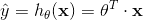

+ `θ`表示模型的参数向量包括偏置项`θ[0]`和特征权重值`θ[1]`到`θ[n]`
+ `θ^T`表示向量`θ`的转置（行向量变为了列向量）
+ `x`为每个样本中特征值的向量形式，包括`x[1]`到`x[n]`，而且`x[0]`恒为 1
+ `θ^T · x`表示`θ^T`和`x`的点积
+ `h[θ]`表示参数为`θ`的假设函数

最小化均方误差（MSE）比最小化均方根误差（RMSE）更加的简单，这两个过程会得到相同的`θ`，因为函数在最小值时候的自变量，同样能使函数的方根运算得到最小值。

公式 2-1 均方根误差（RMSE）

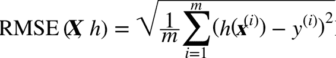

在训练集`X`上使用公式 4-3 来计算线性回归假设`h[θ]`的均方差（MSE）。

公式 4-3：线性回归模型的 MSE 损失函数

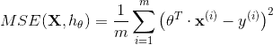

### 正规方程(Normal Equation)

为了找到最小化损失函数的`θ`值，可以通过解正规方程直接得到最后的结果。

## 梯度下降

梯度下降的整体思路是通过的迭代来逐渐调整参数使得损失函数达到最小值。

它计算误差函数关于参数向量`Θ`的局部梯度，同时它沿着梯度下降的方向进行下一次迭代。当梯度值为零的时候，就达到了误差函数最小值。

在梯度下降中一个重要的参数是步长，超参数学习率的值决定了步长的大小。

图 4-4:学习率过小

图 4-5：学习率过大

图 4-6：梯度下降的陷阱

> 提示
>
> 当我们使用梯度下降的时候，应该确保所有的特征有着相近的尺度范围，否则它将需要很长的时间才能够收敛。

### 批量梯度下降（Batch Gradient Descent，BGD）

批量梯度下降的最要问题是计算每一步的梯度时都需要使用整个训练集，这导致在规模较大的数据集上，其会变得非常的慢。

### 随机梯度下降（Stochastic Gradient Descent，SGD）

与其完全相反的随机梯度下降，在每一步的梯度计算上只随机选取训练集中的一个样本。

虽然随机性可以很好的跳过局部最优值，但同时它却不能达到最小值。解决这个难题的一个办法是逐渐降低学习率。 开始时，走的每一步较大（这有助于快速前进同时跳过局部最小值），然后变得越来越小，从而使算法到达全局最小值。 这个过程被称为模拟退火，因为它类似于熔融金属慢慢冷却的冶金学退火过程。 决定每次迭代的学习率的函数称为`learning schedule`。

### 小批量梯度下降（Mini-Batch Gradient Descent,MBGD）

在小批量梯度下降中，它则使用一个随机的小型实例集。

图 4-11：参数空间的梯度下降路径

## 多项式回归

图 4-13：多项式回归模型预测

请注意，当存在多个特征时，多项式回归能够找出特征之间的关系（这是普通线性回归模型无法做到的）。 这是因为`LinearRegression`会自动添加当前阶数下特征的所有组合。例如，如果有两个特征`a,b`，使用 3 阶（`degree=3`）的`LinearRegression`时，不仅有`a^2,a^3,b^2`以及`b^3`，同时也会有它们的其他组合项`ab,a^2b,ab^2`。

> 提示
>
> `PolynomialFeatures(degree=d)`把一个包含`n`个特征的数组转换为一个包含`(n+d)!/(d!n!)`特征的数组，`n!`表示`n`的阶乘，等于`1 * 2 * 3 ... * n`。小心大量特征的组合爆炸！

## 学习曲线

可以使用交叉验证来估计一个模型的泛化能力。另一种方法是观察学习曲线：画出模型在训练集上的表现，同时画出以训练集规模为自变量的训练集函数。为了得到图像，需要在训练集的不同规模子集上进行多次训练。

图 4-15：学习曲线

上面的曲线表现了一个典型的欠拟合模型，两条曲线都到达高原地带并趋于稳定，并且最后两条曲线非常接近，同时误差值非常大。

图 4-16：多项式模型的学习曲线

> 提示
>
> 改善模型过拟合的一种方法是提供更多的训练数据，直到训练误差和验证误差相等。

> 偏差和方差的权衡
>
> 在统计和机器学习领域有个重要的理论：一个模型的泛化误差由三个不同误差的和决定：
>
> + 偏差：泛化误差的这部分误差是由于错误的假设决定的。例如实际是一个二次模型，你却假设了一个线性模型。一个高偏差的模型最容易出现欠拟合。
> + 方差：这部分误差是由于模型对训练数据的微小变化较为敏感，一个多自由度的模型更容易有高的方差（例如一个高阶多项式模型），因此会导致模型过拟合。
> + 不可约误差：这部分误差是由于数据本身的噪声决定的。降低这部分误差的唯一方法就是进行数据清洗（例如：修复数据源，修复坏的传感器，识别和剔除异常值）。

## 线性模型的正则化

降低模型的过拟合的好方法是正则化这个模型（即限制它）：模型有越少的自由度，就越难以拟合数据。例如，正则化一个多项式模型，一个简单的方法就是减少多项式的阶数。

对于一个线性模型，正则化的典型实现就是约束模型中参数的权重。 接下来我们将介绍三种不同约束权重的方法：Ridge 回归，Lasso 回归和 Elastic Net。

### 岭（Ridge）回归

岭回归（也称为 Tikhonov 正则化）是线性回归的正则化版：在损失函数上直接加上一个正则项`α Σ θ[i]^2, i = 1 -> n`。这使得学习算法不仅能够拟合数据，而且能够使模型的参数权重尽量的小。注意到这个正则项只有在训练过程中才会被加到损失函数。当得到完成训练的模型后，我们应该使用没有正则化的测量方法去评价模型的表现。

> 提示
>
> 一般情况下，训练过程使用的损失函数和测试过程使用的评价函数是不一样的。除了正则化，还有一个不同：训练时的损失函数应该在优化过程中易于求导，而在测试过程中，评价函数更应该接近最后的客观表现。一个好的例子：在分类训练中我们使用对数损失（马上我们会讨论它）作为损失函数，但是我们却使用精确率/召回率来作为它的评价函数。

超参数`α`决定了你想正则化这个模型的强度。如果`α = 0`那此时的岭回归便变为了线性回归。如果`α`非常的大，所有的权重最后都接近于零，最后结果将是一条穿过数据平均值的水平直线。公式 4-8 是岭回归的损失函数：

公式 4-8：岭回归损失函数

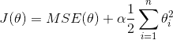

值得注意的是偏差`θ[0]`是没有被正则化的（累加运算的开始是`i=1`而不是`i=0`）。

> 提示
>
> 在使用岭回归前，对数据进行放缩（可以使用`StandardScaler`）是非常重要的，算法对于输入特征的数值尺度（scale）非常敏感。大多数的正则化模型都是这样的。

图 4-17 展示了在相同线性数据上使用不同`α`值的岭回归模型最后的表现。注意当`α`增大的时候，导致预测曲线变得扁平（即少了极端值，多了一般值），这样减少了模型的方差，却增加了模型的偏差。

Lasso 回归（也称 Least Absolute Shrinkage，或者 Selection Operator Regression）是另一种正则化版的线性回归：就像岭回归那样，它也在损失函数上添加了一个正则化项，但是它使用权重向量的`l1`范数而不是权重向量`l2`范数平方的一半。（如公式 4-10）

公式 4-10：Lasso 回归的损失函数

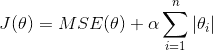

图 4-18：Lasso 回归

Lasso 回归的一个重要特征是它倾向于完全消除最不重要的特征的权重（即将它们设置为零）。例如，右图中的虚线所示（α = 10^(-7)），曲线看起来像一条二次曲线，而且几乎是线性的，这是因为所有的高阶多项特征都被设置为零。换句话说，Lasso 回归自动的进行特征选择同时输出一个稀疏模型（即，具有很少的非零权重）。

图 4-19：Ridge 回归和 Lasso 回归对比

> 提示
>
> 在 Lasso 损失函数中，批量梯度下降的路径趋向与在低谷有一个反弹。这是因为在`θ[2] = 0`时斜率会有一个突变。为了最后真正收敛到全局最小值，你需要逐渐的降低学习率。

### 弹性网络（ElasticNet）

弹性网络介于 Ridge 回归和 Lasso 回归之间。它的正则项是 Ridge 回归和 Lasso 回归正则项的简单混合，同时你可以控制它们的混合率`r`，当`r = 0`时，弹性网络就是 Ridge 回归，当`r = 1`时，其就是 Lasso 回归。具体表示如公式 4-12。

公式 4-12：弹性网络损失函数

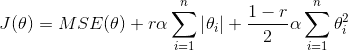

一般来说有一点正则项的表现更好。岭回归是一个很好的首选项，但是如果你的特征仅有少数是真正有用的，你应该选择 Lasso 和弹性网络。它两能够将无用特征的权重降为零。一般来说，弹性网络的表现要比 Lasso 好，因为当特征数量比样本的数量大的时候，或者特征之间有很强的相关性时，Lasso 可能会表现的不规律。

### 早期停止法（Early Stopping）

对于迭代学习算法，有一种非常特殊的正则化方法，就像梯度下降在验证错误达到最小值时立即停止训练那样。我们称为早期停止法。

图 4-20：早期停止法

## 逻辑回归

一些回归算法也可以用于分类（反之亦然）。 Logistic 回归（也称为 Logit 回归）通常用于估计一个实例属于某个特定类别的概率。 这样便成为了一个二元分类器。

### 概率估计

就像线性回归模型一样，Logistic 回归模型计算输入特征的加权和（加上偏差项），但它不像线性回归模型那样直接输出结果，而是把结果输入`logistic()`函数进行二次加工后进行输出（详见公式 4-13）。

公式 4-13：逻辑回归模型的概率估计（向量形式）

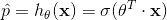

Logistic 函数（也称为 logit），用`σ()`表示，其是一个 sigmoid 函数（图像呈 S 型），它的输出是一个介于 0 和 1 之间的数字。其定义如公式 4-14 和图 4-21 所示。

公式 4-14：逻辑函数

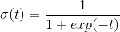

图 4-21：逻辑函数

一旦 Logistic 回归模型估计得到了`x`属于正类的概率`p_hat = h[θ](x)`，那它很容易得到预测结果`y_hat`（见公式 4-15）。

公式 4-15：逻辑回归预测模型

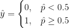

注意当`t < 0`时`σ(t) < 0.5`，当`t >= 0`时`σ(t) >= 0.5`，因此当`θ^T · x`是正数的话，逻辑回归模型输出 1，如果它是负数的话，则输出 0。

### 训练和损失函数

Logistic 回归模型的训练是通过设置参数向量`θ`，使得正例（`y = 1`）概率增大，负例（`y = 0`）的概率减小，其通过在单个训练实例`x`的损失函数来实现（公式 4-16）。

公式 4-16：单个样本的损失函数

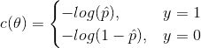

整个训练集的损失函数是所有训练实例的平均值。可以用一个表达式（你可以很容易证明）来统一表示，称为对数损失，如公式 4-17 所示。

公式 4-17：逻辑回归的损失函数（对数损失）

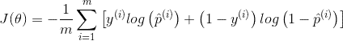

### 决策边界

图 4-23：概率估计和决策边界

### Softmax 回归

Logistic 回归模型可以直接推广到支持多类别分类，不必组合和训练多个二分类器， 其称为 Softmax 回归或多类别 Logistic 回归。

当给定一个实例`x`时，Softmax 回归模型首先计算`k`类的分数`s[k](x)`，然后将分数应用在`Softmax`函数（也称为归一化指数）上，估计出每类的概率。 计算`s[k](x)`的公式看起来很熟悉，因为它就像线性回归预测的公式一样（见公式 4-19）。

公式 4-19：`k`类的 Softmax 得分

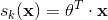

注意，每个类都有自己独一无二的参数向量`θ[k]`。 所有这些向量通常作为行放在参数矩阵`θ`中。

一旦你计算了样本`x`的每一类的得分，你便可以通过`Softmax`函数（公式 4-20）估计出样本属于第`k`类的概率`p_hat[k]`：通过计算`e`的`s[k](x)`次方，然后对它们进行归一化（除以所有分子的总和）。

公式 4-20：Softmax 函数

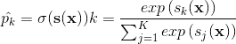

+ `K`表示有多少类
+ `s(x)`表示包含样本`x`每一类得分的向量
+ `σ(s(x)[k])`表示给定每一类分数之后，实例`x`属于第`k`类的概率

和 Logistic 回归分类器一样，Softmax 回归分类器将估计概率最高（它只是得分最高的类）的那类作为预测结果。

> 注意
>
> Softmax 回归分类器一次只能预测一个类（即它是多类的，但不是多输出的），因此它只能用于判断互斥的类别，如不同类型的植物。 你不能用它来识别一张照片中的多个人。

接下来将介绍如何训练。我们的目标是建立一个模型在目标类别上有着较高的概率（因此其他类别的概率较低），最小化公式 4-22 可以达到这个目标，其表示了当前模型的损失函数，称为交叉熵，当模型对目标类得出了一个较低的概率，其会惩罚这个模型。 交叉熵通常用于衡量待测类别与目标类别的匹配程度。

公式 4-22：交叉熵

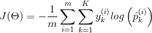

+ 如果对于第`i`个实例的目标类是`k`，那么`y[k]^(i) = 1`，反之`y[k]^(i) = 0`。

可以看出，当只有两个类（`K = 2`）时，此损失函数等同于 Logistic 回归的损失函数。

图 4-25：Softmax 回归的决策边界

图 4-25 用不同背景色表示了结果的决策边界。注意，任何两个类之间的决策边界是线性的。 该图的曲线表示 Versicolor 类的概率（例如，用 0.450 标记的曲线表示 45% 的概率边界）。注意模型也可以预测一个概率低于 50% 的类。 例如，在所有决策边界相遇的地方，所有类的估计概率相等，分别为 33%。