# 五、支持向量机

支持向量机（SVM）能够做线性或者非线性的分类，回归，甚至异常值检测。机器学习领域中最为流行的模型之一。SVM 特别适合应用于复杂但中小规模数据集的分类问题。

## 线性支持向量机分类

右边图中 SVM 分类器在两种类别之间保持了一条尽可能宽敞的街道（图中平行的虚线），其被称为最大间隔分类。

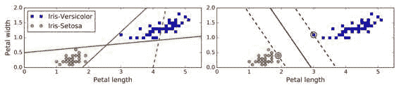

添加更多的样本点在“街道”外并不会影响到判定边界，因为判定边界是由位于“街道”边缘的样本点确定的，这些样本点被称为“支持向量”（图 5-1 中被圆圈圈起来的点）

> 警告
> 
> SVM 对特征缩放比较敏感，可以看到图 5-2：左边的图中，垂直的比例要更大于水平的比例，所以最宽的“街道”接近水平。但对特征缩放后，判定边界看起来要好得多，如右图。

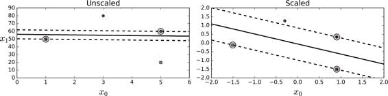

### 软间隔分类

如果我们严格地规定所有的数据都不在“街道”上，都在正确地两边，称为硬间隔分类，硬间隔分类有两个问题，第一，只对线性可分的数据起作用，第二，对异常点敏感。图 5-3 显示了只有一个异常点的鸢尾花数据集：左边的图中很难找到硬间隔。

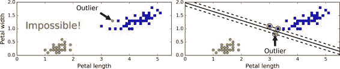

为了避免上述的问题，我们更倾向于使用更加软性的模型。目的在保持“街道”尽可能大和避免间隔违规（例如：数据点出现在“街道”中央或者甚至在错误的一边）之间找到一个良好的平衡。这就是软间隔分类。

可以用`C`超参数（惩罚系数）来控制这种平衡：较小的`C`会导致更宽的“街道”，但更多的间隔违规。

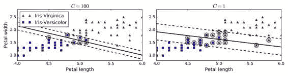

> 提示
> 
> 如果你的 SVM 模型过拟合，你可以尝试通过减小超参数`C`去调整。 

## 非线性支持向量机分类

尽管线性 SVM 分类器在许多案例上表现得出乎意料的好，但是很多数据集并不是线性可分的。一种处理非线性数据集方法是增加更多的特征，例如多项式特征（正如你在第 4 章所做的那样）；在某些情况下可以变成线性可分的数据。在图 5-5 的左图中，它只有一个特征`x1`的简单的数据集，正如你看到的，该数据集不是线性可分的。但是如果你增加了第二个特征 `x2=(x1)^2`，产生的 2D 数据集就能很好的线性可分。

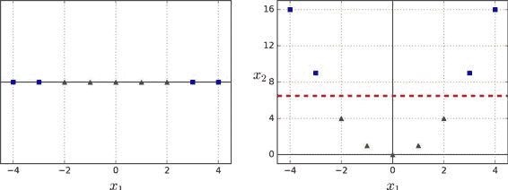

### 多项式核

使用 SVM 时，你可以运用一个被称为“核技巧”（kernel trick）的神奇数学技巧。通过使用核函数（kernel function），在低维空间中计算高维空间中的内积，而无需直接计算高维空间的特征。

图 5-7 的左图用 3 阶的多项式核训练了一个 SVM 分类器。右图是使用了 10 阶的多项式核 SVM 分类器。很明显，如果你的模型过拟合，你可以减小多项式核的阶数。相反的，如果是欠拟合，你可以尝试增大它。超参数`coef0`控制了高阶多项式与低阶多项式对模型的影响。

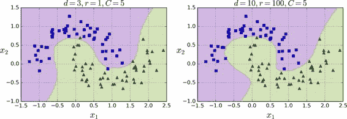

### 增加相似特征

另一种解决非线性问题的方法是使用相似函数（similarity funtion）计算每个样本与特定地标（landmark）的相似度。例如，让我们来看看前面讨论过的一维数据集，并在`x1=-2`和`x1=1`之间增加两个地标（图 5-8 左图）。接下来，我们定义一个相似函数，即高斯径向基函数（Gaussian Radial Basis Function，RBF），设置`γ = 0.3`（见公式 5-1）

公式 5-1 RBF

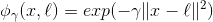

它是个从 0 到 1 的钟型函数，值为 0 的离地标很远，值为 1 的在地标上。现在我们准备计算新特征。例如，我们看一下样本`x1=-1`：它距离第一个地标距离是 1，距离第二个地标是 2。因此它的新特征为`x2=exp(-0.3 × (1^2))≈0.74`和`x3=exp(-0.3 × (2^2))≈0.30`。图 5-8 右边的图显示了特征转换后的数据集（删除了原始特征），正如你看到的，它现在是线性可分了。

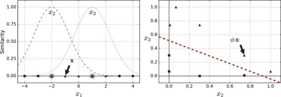

你可能想知道如何选择地标。最简单的方法是在数据集中的每一个样本的位置创建地标。这将产生更多的维度从而增加了转换后数据集是线性可分的可能性。但缺点是，`m`个样本，`n`个特征的训练集被转换成了`m`个实例，`m`个特征的训练集（假设你删除了原始特征）。这样一来，如果你的训练集非常大，你最终会得到同样大的特征。

### 高斯 RBF 核

这个模型在图 5-9 的左下角表示。其他的图显示了用不同的超参数`gamma (γ)`和`C`训练的模型。增大`γ`使钟型曲线更窄（图 5-8 左图），导致每个样本的影响范围变得更小：即判定边界最终变得更不规则，在单个样本周围环绕。相反的，较小的`γ`值使钟型曲线更宽，样本有更大的影响范围，判定边界最终则更加平滑。所以γ是可调整的超参数：如果你的模型过拟合，你应该减小`γ`值，若欠拟合，则增大`γ`（与超参数`C`相似）。

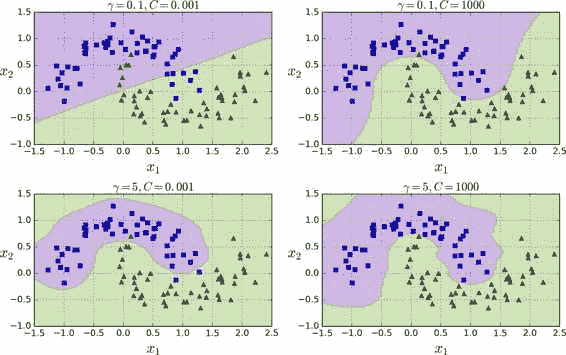

### 计算复杂性

## SVM 回归

SVM 算法应用广泛：不仅仅支持线性和非线性的分类任务，还支持线性和非线性的回归任务。技巧在于逆转我们的目标：限制间隔违规的情况下，不是试图在两个类别之间找到尽可能大的“街道”（即间隔）。SVM 回归任务是限制间隔违规情况下，尽量放置更多的样本在“街道”上。“街道”的宽度由超参数`ϵ`控制。图 5-10 显示了在一些随机生成的线性数据上，两个线性 SVM 回归模型的训练情况。一个有较大的间隔（`ϵ=1.5`），另一个间隔较小（`ϵ=0.5`）。

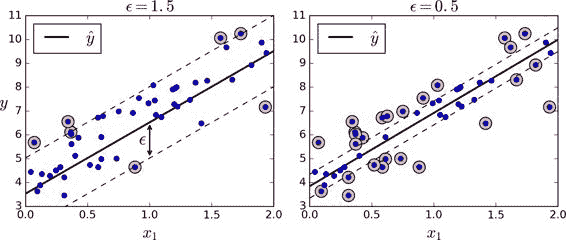

添加更多的数据样本在间隔之内并不会影响模型的预测，因此，这个模型认为是不敏感的（ϵ-insensitive）。

处理非线性回归任务，你可以使用核化的 SVM 模型。比如，图 5-11 显示了在随机二次方的训练集，使用二次方多项式核函数的 SVM 回归。左图是较小的正则化（即更大的`C`值），右图则是更大的正则化（即小的`C`值）

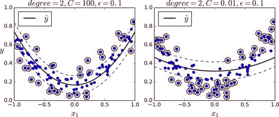

## 背后机制

符号约定：偏置项被命名为`b`，特征权重向量被称为`w`，在输入特征向量中不再添加偏置特征。

### 决策函数和预测

线性 SVM 分类器通过简单地计算决策函数`w · x + b = w[1] x[1] + ... + w[n] x[n] + b`来预测新样本的类别：如果结果是正的，预测类别`ŷ`是正类，为 1，否则他就是负类，为 0。见公式 5-2。

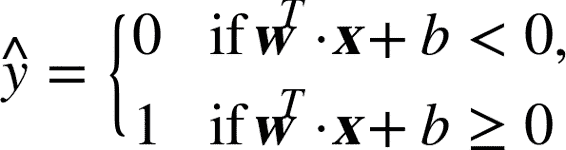

图 5-12 显示了和图 5-4 右边图模型相对应的决策函数：因为这个数据集有两个特征（花瓣的宽度和花瓣的长度），所以是个二维的平面。决策边界是决策函数等于 0 的点的集合，图中两个平面的交叉处，即一条直线（图中的实线）

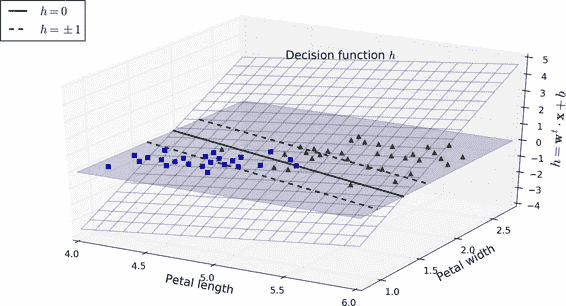

虚线表示的是那些决策函数等于 1 或 -1 的点：它们平行，且到决策边界的距离相等，形成一个间隔。训练线性 SVM 分类器意味着找到`w`值和`b`值使得这一个间隔尽可能大，同时避免间隔违规（硬间隔）或限制它们（软间隔）。

### 训练目标

看下决策函数的斜率：它等于权重向量的范数`||w||`。如果我们把这个斜率除于 2，决策函数等于 ±1 的点将会离决策边界原来的两倍大。换句话，即斜率除于 2，那么间隔将增加两倍。在图 5-13 中，2D 形式比较容易可视化。权重向量`w`越小，间隔越大。

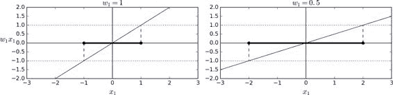
