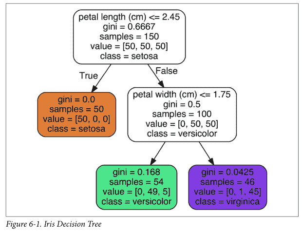
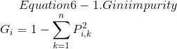
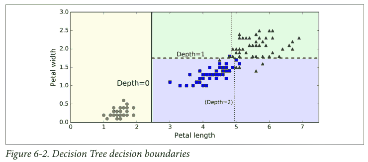
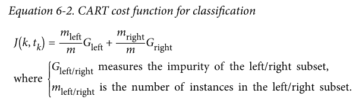
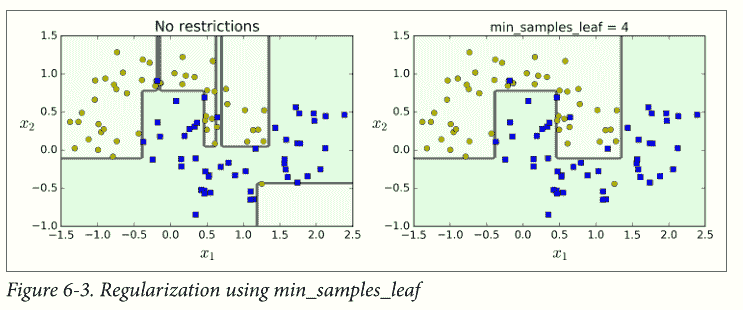
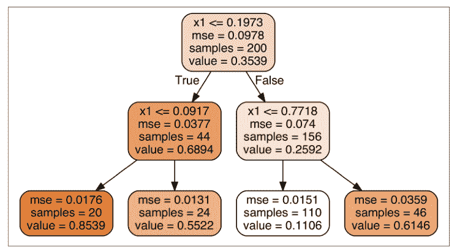
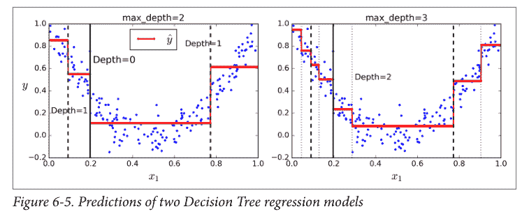
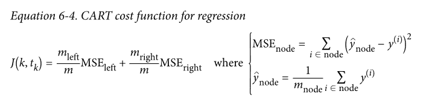
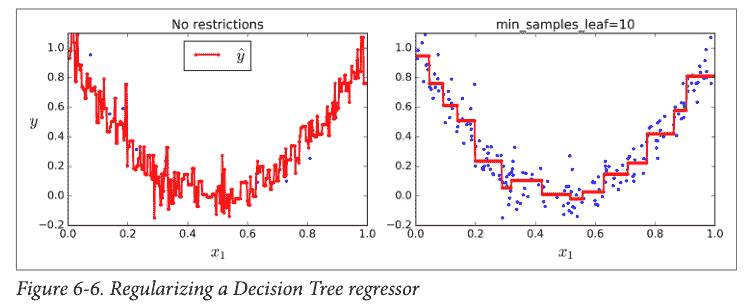
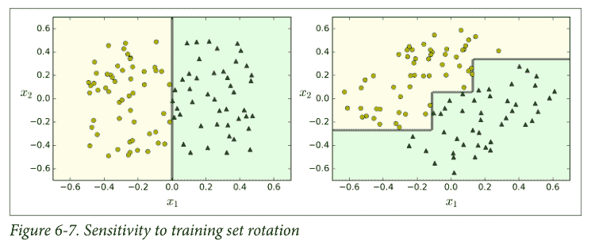

# 六、决策树

决策树是一种多功能机器学习算法， 即可以执行分类任务也可以执行回归任务， 甚至包括多输出（multioutput）任务。

决策树也是随机森林的基本组成部分，而随机森林是当今最强大的机器学习算法之一。

## 决策树的训练和可视化

我们的第一个决策树如图 6-1。

## 开始预测

现在让我们来看看在图 6-1 中的树是如何进行预测的。假设你找到了一朵鸢尾花并且想对它进行分类，你从根节点开始（深度为 0，顶部）：该节点询问花朵的花瓣长度是否小于 2.45 厘米。如果是，您将向下移动到根的左侧子节点（深度为 1，左侧）。 在这种情况下，它是一片叶子节点（即它没有任何子节点），决策树预测你的花是 Iris-Setosa（`class = setosa`）。

现在假设你找到了另一朵花，但这次的花瓣长度是大于 2.45 厘米的。你必须向下移动到根的右侧子节点（深度为 1，右侧），而这个节点不是叶节点，所以它会问另一个问题：花瓣宽度是否小于 1.75 厘米？ 如果是，那么你的花很可能是一个 Iris-Versicolor（深度为 2，左）。 如果不是，那很可能一个 Iris-Virginica（深度为 2，右）。

> 决策树的众多特性之一就是， 它不需要太多的数据预处理， 尤其是不需要进行特征的缩放或者归一化。

节点的`samples`属性统计出它应用于多少个训练样本实例。

节点的`value`属性告诉你这个节点对于每一个类别的样例有多少个。

最后，节点的`Gini`属性用于测量它的纯度：如果一个节点包含的所有训练样例全都是同一类别的，我们就说这个节点是纯的（`Gini=0`）。

公式 6-1 显示了训练算法如何计算第`i`个节点的 gini 分数`G[i]`。例如， 深度为 2 的左侧节点基尼指数为：`1 - (0 / 54)^2 - (49 / 54)^2 - (5 / 54)^2 = 0.168`。

图 6-2 显示了决策树的决策边界。粗的垂直线代表根节点（深度为 0）的决定边界：花瓣长度为 2.45 厘米。由于左侧区域是纯的（只有 Iris-Setosa），所以不能再进一步分裂。然而，右边的区域是不纯的，所以深度为 1 的右边节点在花瓣宽度为 1.75 厘米处分裂（用虚线表示）。又由于`max_depth`设置为 2，决策树在那里停了下来。但是，如果将`max_depth`设置为 3，两个深度为 2 的节点，每个都将会添加另一个决策边界（用虚线表示）。

> 模型小知识：白盒与黑盒
>
> 正如我们看到的一样，决策树非常直观，他们的决定很容易被解释。这种模型通常被称为白盒模型。相反，随机森林或神经网络通常被认为是黑盒模型。他们能做出很好的预测，并且您可以轻松检查它们做出这些预测过程中计算的执行过程。然而，人们通常很难用简单的术语来解释为什么模型会做出这样的预测。决策树提供良好的、简单的分类规则，甚至可以根据需要手动操作（例如鸢尾花分类）。

## 估计分类概率

决策树还可以估计某个实例属于特定类`k`的概率：首先遍历树来查找此实例的叶节点，然后它返回此节点中类`k`的训练实例的比例。

例如，假设你发现了一个花瓣长 5 厘米，宽 1.5 厘米的花朵。相应的叶节点是深度为 2 的左节点，因此决策树应该输出以下概率：Iris-Setosa 为 0%（`0/54`），Iris-Versicolor 为 90.7%（`49/54`），Iris-Virginica 为 9.3%（`5/54`）。当然，如果你要求它预测具体的类，它应该输出 Iris-Versicolor（类别 1），因为它具有最高的概率。

## CART 训练算法

Scikit-Learn 用分裂回归树（Classification And Regression Tree，简称 CART）算法训练决策树（也叫“增长树”）。

首先使用单个特征`k`和阈值`t[k]`（例如，“花瓣长度`≤2.45cm`”）将训练集分成两个子集。它如何选择`k`和`t[k]`呢？它寻找到能够产生最纯粹的子集一对`(k, t[k])`，然后通过子集大小加权计算。

算法会尝试最小化成本函数。方法如公式 6-2

当它成功的将训练集分成两部分之后， 它将会继续使用相同的递归式逻辑继续的分割子集，然后是子集的子集。当达到预定的最大深度之后将会停止分裂（由`max_depth`超参数决定），或者是它找不到可以继续降低不纯度的分裂方法的时候。几个其他超参数（之后介绍）控制了其他的停止生长条件（`min_samples_split`，`min_samples_leaf`，`min_weight_fraction_leaf`，`max_leaf_nodes`）。

> CART 算法是一种贪婪算法：它贪婪地搜索最高级别的最佳分割方式，然后在每个深度重复该过程。 它不检查分割是否能够在几个级别中的全部分割可能中找到最佳方法。贪婪算法通常会产生一个相当好的解决方法，但它不保证这是全局中的最佳解决方案。

## 基尼不纯度或是信息熵

通常，算法使用 Gini 不纯度来进行检测， 但是你也可以通过将标准超参数设置为`"entropy"`来使用熵不纯度进行检测。

在机器学习中，熵经常被用作不纯度的衡量方式，当一个集合内只包含一类实例时， 我们称为数据集的熵为 0。

> 熵的减少通常称为信息增益。

公式 6-3 显示了第`i`个节点的熵的定义，例如，在图 6-1 中， 深度为 2 左节点的熵为`-49/54 ln(49/54) - 5/54 ln(5/54) = 0.31`。

那么我们到底应该使用 Gini 指数还是熵呢？ 事实上大部分情况都没有多大的差别：他们会生成类似的决策树。 

基尼指数计算稍微快一点，所以这是一个很好的默认值。但是，也有的时候它们会产生不同的树，基尼指数会趋于在树的分支中将最多的类隔离出来，而熵指数趋向于产生略微平衡一些的决策树模型。

## 正则化超参数

决策树几乎不对训练数据做任何假设（于此相反的是线性回归等模型，这类模型通常会假设数据是符合线性关系的）。

如果不添加约束，树结构模型通常将根据训练数据调整自己，使自身能够很好的拟合数据，而这种情况下大多数会导致模型过拟合。

这一类的模型通常会被称为非参数模型，这不是因为它没有任何参数（通常也有很多），而是因为在训练之前没有确定参数的具体数量，所以模型结构可以根据数据的特性自由生长。

于此相反的是，像线性回归这样的参数模型有事先设定好的参数数量，所以自由度是受限的，这就减少了过拟合的风险（但是增加了欠拟合的风险）。

图 6-3 显示了对`moons`数据集（在第 5 章介绍过）进行训练生成的两个决策树模型，左侧的图形对应的决策树使用默认超参数生成（没有限制生长条件），右边的决策树模型设置为`min_samples_leaf=4`。很明显，左边的模型过拟合了，而右边的模型泛用性更好。

## 回归

决策树也能够执行回归任务，结果如图 6-4 所示。

这棵树看起来非常类似于你之前建立的分类树，它的主要区别在于，它不是预测每个节点中的样本所属的分类，而是预测一个具体的数值。例如，假设您想对`x[1] = 0.6`的新实例进行预测。从根开始遍历树，最终到达预测值等于 0.1106 的叶节点。该预测仅仅是与该叶节点相关的 110 个训练实例的平均目标值。而这个预测结果在对应的 110 个实例上的均方误差（MSE）等于 0.0151。

> 译者注：图里面的红线就是训练实例的平均目标值，对应上图中的`value`

CART 算法的工作方式与之前处理分类模型基本一样，不同之处在于，现在不再以最小化不纯度的方式分割训练集，而是试图以最小化 MSE 的方式分割训练集。 

公式 6-4 显示了成本函数，该算法试图最小化这个成本函数。

和处理分类任务时一样，决策树在处理回归问题的时候也容易过拟合。如果不添加任何正则化，你就会得到图 6-6 左侧的预测结果，显然，过度拟合的程度非常严重。而当我们设置了`min_samples_leaf = 10`，相对就会产生一个更加合适的模型了，就如图 6-6 所示的那样。

## 不稳定性

决策树也有一些限制，决策树很喜欢设定正交化的决策边界，（所有边界都是和某一个轴相垂直的），这使得它对训练数据集的旋转很敏感，例如图 6-7 显示了一个简单的线性可分数据集。在左图中，决策树可以轻易的将数据分隔开，但是在右图中，当我们把数据旋转了 45° 之后，决策树的边界看起来变的格外复杂。尽管两个决策树都完美的拟合了训练数据，右边模型的泛化能力很可能非常差。

解决这个难题的一种方式是使用 PCA 主成分分析（第八章），这样通常能使训练结果变得更好一些。

 

更加通俗的讲，决策时的主要问题是它对训练数据的微小变化非常敏感。