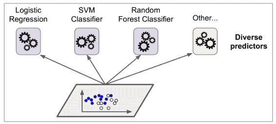
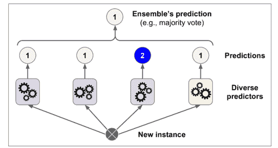
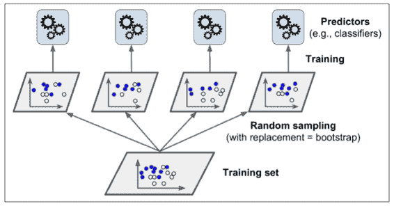
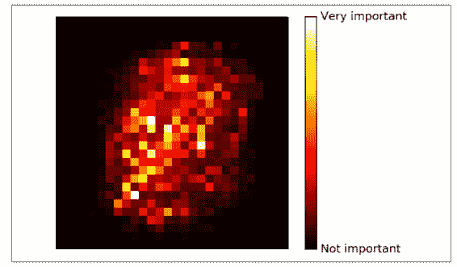
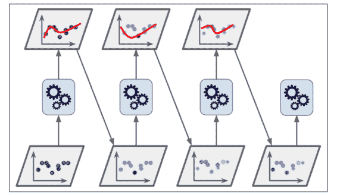
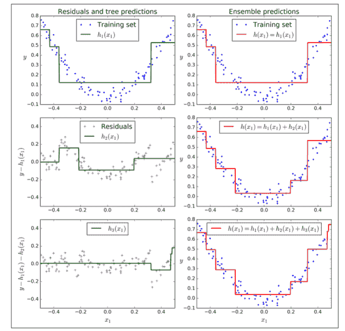
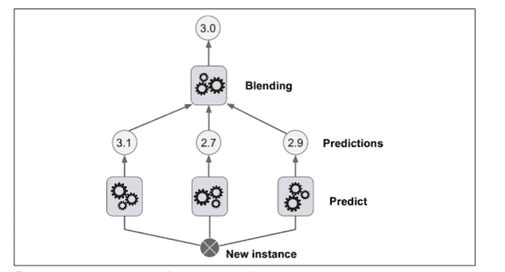
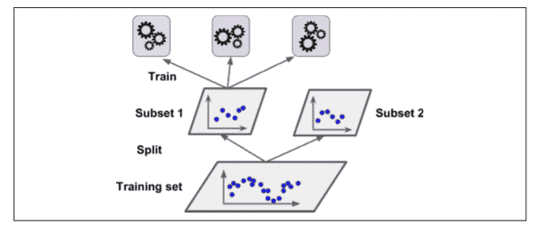
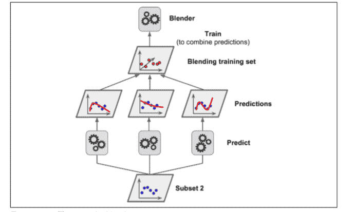

# 七、集成学习和随机森林

## 投票分类

一个非常简单去创建一个更好的分类器的方法就是去整合每一个分类器的预测然后经过投票去预测分类。这种分类器就叫做硬投票分类器（详见图 7-2）。

这种投票分类器得出的结果经常会比集成中最好的一个分类器结果更好。事实上，即使每一个分类器都是一个弱学习器（意味着它们也就比瞎猜好点），集成后仍然是一个强学习器（高准确率）。

如果使每一个分类器都独立自主的分类、不会发生有相关性的错误，那么集成模型会工作的很好。得到多样的分类器的方法之一就是用完全不同的算法，这会使它们会做出不同种类的错误，这会提高集成的正确率。

硬投票（Hard Voting）：
硬投票是一种投票策略，其中集成模型会对每个基分类器的预测结果进行简单的统计，然后根据多数表决原则来确定最终的集成预测结果。

软投票（Soft Voting）：
软投票是另一种投票策略，它考虑了基分类器的预测概率（或置信度），并根据加权平均的方式来确定最终的集成预测结果。

## Bagging 和 Pasting 

就像之前讲到的，可以通过使用不同的训练算法去得到一些不同的分类器。另一种方法就是对每一个分类器都使用相同的训练算法，但是在不同的训练集上去训练它们。有放回采样被称为装袋（*Bagging*，是 *bootstrap aggregating* 的缩写）。无放回采样称为粘贴（*pasting*）。

Bagging 和 Pasting 都允许在多个分类器上对训练集进行多次采样，但只有 Bagging 允许对同一种分类器上对训练集进行进行多次采样。采样和训练过程如图 7-4 所示。Bagging 通常会导致更好的模型。

通常情况下，集成的结果是有一个相似的偏差，但是对比与在原始训练集上的单一分类器来讲有更小的方差。

分类器可以通过不同的 CPU 核或其他的服务器一起被训练。它们的可扩展性很好。

## 随机森林

随机森林是决策树的一种集成，通常是通过 bagging 方法（有时是 pasting 方法）进行训练。

### 极随机树

可以通过使用对特征使用随机阈值使树更加随机（像规则决策树一样）。

这种极随机的树被简称为 *Extremely Randomized Trees*（极随机树），或者更简单的称为 *Extra-Tree*。再一次用高偏差换低方差。它还使得 *Extra-Tree* 比规则的随机森林更快地训练，因为在每个节点上找到每个特征的最佳阈值是生长树最耗时的任务之一。

### 特征重要度

最后，如果你观察一个单一决策树，重要的特征会出现在更靠近根部的位置，而不重要的特征会经常出现在靠近叶子的位置。因此我们可以通过计算一个特征在森林的全部树中出现的平均深度来预测特征的重要性。

在 MNIST 数据上训练随机森林分类器，然后画出每个像素的重要性，你可以得到图 7-6 的图片。

随机森林可以非常方便快速得了解哪些特征实际上是重要的，特别是你需要进行特征选择的时候。

## 提升

提升（Boosting）是一种集成学习方法，旨在将多个弱分类器（通常是基于简单的模型，比如决策树）组合成一个强分类器，以提高整体性能。提升方法通过迭代训练一系列基分类器，并逐步纠正之前模型的错误，从而生成一个更准确的集成模型。最著名的就是 *Adaboost*（适应性提升，是 *Adaptive Boosting* 的简称） 和 *Gradient Boosting*（梯度提升）。

### Adaboost

在每一轮迭代中，AdaBoost 会给错误分类的样本更高的权重，以便在下一轮中更多地关注这些错误样本，从而逐步改进模型。

### 梯度提升

梯度提升并不像 Adaboost 那样每一次迭代都更改实例的权重，这个方法是去使用新的分类器去拟合前面分类器预测的*残差* 。

## Stacking

最后一个集成方法叫做 *Stacking*（*stacked generalization* 的缩写）。这个算法基于一个简单的想法：不使用琐碎的函数（如硬投票）来聚合集合中所有分类器的预测，我们为什么不训练一个模型来执行这个聚合？图 7-12 展示了这样一个在新的回归实例上预测的集成。底部三个分类器每一个都有不同的值（3.1，2.7 和 2.9），然后最后一个分类器（叫做 *blender* 或者*元学习器*）把这三个分类器的结果当做输入然后做出最终决策（3.0）。

为了训练这个 *blender*，首先，训练集被分为两个子集，第一个子集被用作训练第一层（详见图 7-13）.

 

接下来，第一层的分类器被用来预测第二个子集（保持集）（详见 7-14）。这确保了预测结果很“干净”，因为这些分类器在训练的时候没有使用过这些实例。现在对在保持集中的每一个实例都有三个预测值。我们现在可以使用这些预测结果作为输入特征来创建一个新的训练集，并且保持目标数值不变。随后 *blender* 在这个新的训练集上训练，因此，它学会了预测第一层预测的目标值。

