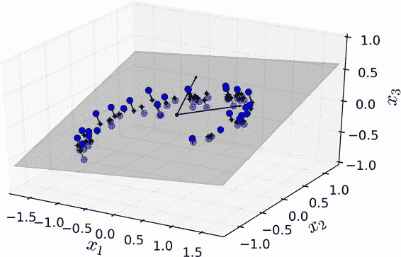
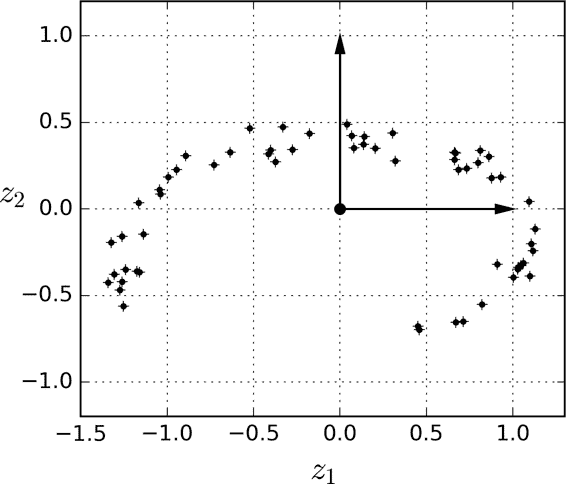
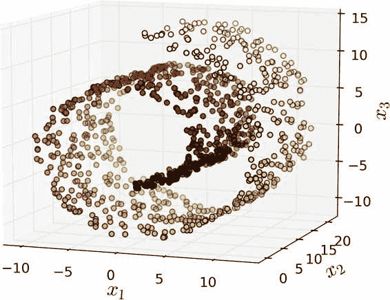
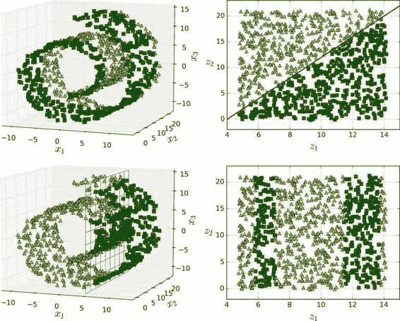
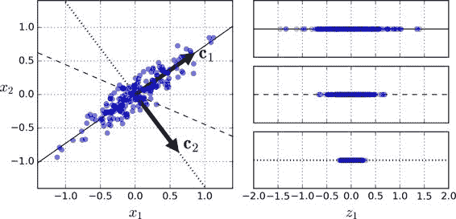
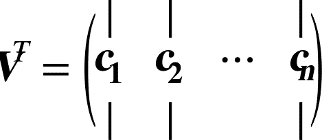
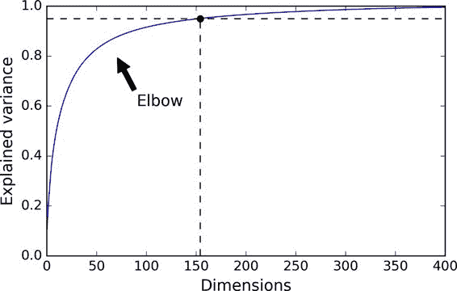
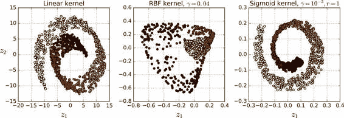
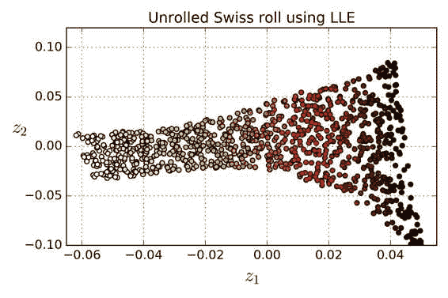

# 八、降维

降维除了可以加快训练速度外，在数据可视化方面（或者 DataViz）也十分有用。

## 维数灾难

训练集的维度越高，过拟合的风险就越大。

## 降维的主要方法

降低维度的两种主要方法：投影和流形学习。

### 投影（Projection）



图 8-2 一个分布接近于 2D 子空间的 3D 数据集



图 8-3 一个经过投影后的新的 2D 数据集 

但是，投影并不总是降维的最佳方法。在很多情况下，子空间可能会扭曲和转动，比如图 8-4 所示的着名瑞士滚动玩具数据集。  



### 流形学习

瑞士卷一个是二维流形的例子。简而言之，二维流形是一种二维形状，它可以在更高维空间中弯曲或扭曲。更一般地，一个`d`维流形是类似于`d`维超平面的`n`维空间（其中`d < n`）的一部分。在我们瑞士卷这个例子中，`d = 2`，`n = 3`：它有些像 2D 平面，但是它实际上是在第三维中卷曲。  

简而言之，如果在训练模型之前降低训练集的维数，那训练速度肯定会加快，但并不总是会得出更好的训练效果；这一切都取决于数据集。 



图 8-6 决策边界并不总是会在低维空间中变的简单  

## 主成分分析（PCA）

主成分分析（Principal Component Analysis）是目前为止最流行的降维算法。首先它找到接近数据集分布的超平面，然后将所有的数据都投影到这个超平面上。  

### 保留（最大）方差

投影到实线上保留了最大方差，而在点线上的投影只保留了非常小的方差。选择保持最大方差的轴看起来是合理的，因为它很可能比其他投影损失更少的信息。



图 8-7 选择投射到哪一个子空间  

### 主成分（Principle Componets）

在一个更高维的数据集中，PCA 也可以找到与前两个轴正交的第三个轴，以及与数据集中维数相同的第四个轴，第五个轴等。定义第`i`个轴的单位向量被称为第`i`个主成分（PC）。在图 8-7 中，第一个 PC 是`c1`，第二个 PC 是`c2`。在图 8-2 中，前两个 PC 用平面中的正交箭头表示，第三个 PC 与上述 PC 形成的平面正交（指向上或下）。  

> 概述： 主成分的方向不稳定：如果您稍微打乱一下训练集并再次运行 PCA，则某些新 PC 可能会指向与原始 PC 方向相反。但是，它们通常仍位于同一轴线上。在某些情况下，一对 PC 甚至可能会旋转或交换，但它们定义的平面通常保持不变。  

那么如何找到训练集的主成分呢？幸运的是，有一种称为奇异值分解（SVD）的标准矩阵分解技术，可以将训练集矩阵`X`分解为三个矩阵`U·Σ·V^T`的点积，其中`V^T`包含我们想要的所有主成分，如公式 8-1 所示。  

公式 8-1 主成分矩阵



### 投影到`d`维空间

一旦确定了所有的主成分，你就可以通过将数据集投影到由前`d`个主成分构成的超平面上，从而将数据集的维数降至`d`维。选择这个超平面可以确保投影将保留尽可能多的方差。

### 方差解释率（Explained Variance Ratio）

另一个非常有用的信息是每个主成分的方差解释率，可通过`explained_variance_ratio_`变量获得。它表示位于每个主成分轴上的数据集方差的比例。例如，让我们看一下图 8-2 中表示的三维数据集前两个分量的方差解释率：  

```
>>> print(pca.explained_variance_ratio_)
array([0.84248607, 0.14631839])
```

这表明，84.2% 的数据集方差位于第一轴，14.6% 的方差位于第二轴。第三轴的这一比例不到 1.2%，因此可以认为它可能没有包含什么信息。

### 选择正确的维度

通常我们倾向于选择加起来到方差解释率能够达到足够占比（例如 95%）的维度的数量，而不是任意选择要降低到的维度数量。当然，除非您正在为数据可视化而降低维度 -- 在这种情况下，您通常希望将维度降低到 2 或 3。  

另一种选择是画出方差解释率关于维数的函数（简单地绘制`cumsum`；参见图 8-8）。曲线中通常会有一个肘部，方差解释率停止快速增长。您可以将其视为数据集的真正的维度。在这种情况下，您可以看到将维度降低到大约 100 个维度不会失去太多的可解释方差。  




图 8-8 可解释方差关于维数的函数 

### PCA 压缩

通过应用 PCA 投影的逆变换，也可以将缩小的数据集解压缩回 784 维。当然这并不会返回给你最原始的数据，因为投影丢失了一些信息（在 5% 的方差内），但它可能非常接近原始数据。原始数据和重构数据之间的均方距离（压缩然后解压缩）被称为重构误差（reconstruction error）。

## 核 PCA（Kernel PCA）

在第 5 章中，我们讨论了核技巧，一种将实例隐式映射到非常高维空间（称为特征空间）的数学技术，让支持向量机可以应用于非线性分类和回归。回想一下，高维特征空间中的线性决策边界对应于原始空间中的复杂非线性决策边界。  

事实证明，同样的技巧可以应用于 PCA，从而可以执行复杂的非线性投影来降低维度。这就是所谓的核 PCA（kPCA）。它通常能够很好地保留投影后的簇，有时甚至可以展开分布近似于扭曲流形的数据集。 

图 8-10 展示了使用线性核（等同于简单的使用 PCA 类），RBF 核，sigmoid 核（Logistic）将瑞士卷降到 2 维。




图 8-10 使用不同核的 kPCA 将瑞士卷降到 2 维

### LLE

局部线性嵌入（Locally Linear Embedding）是另一种非常有效的非线性降维（NLDR）方法。这是一种流形学习技术，不依赖于像以前算法那样的投影。简而言之，LLE 首先测量每个训练实例与其最近邻（c.n.）之间的线性关系，然后寻找能最好地保留这些局部关系的训练集的低维表示（稍后会详细介绍） 。这使得它特别擅长展开扭曲的流形，尤其是在没有太多噪音的情况下。  



图 8-12 使用 LLE 展开瑞士卷  